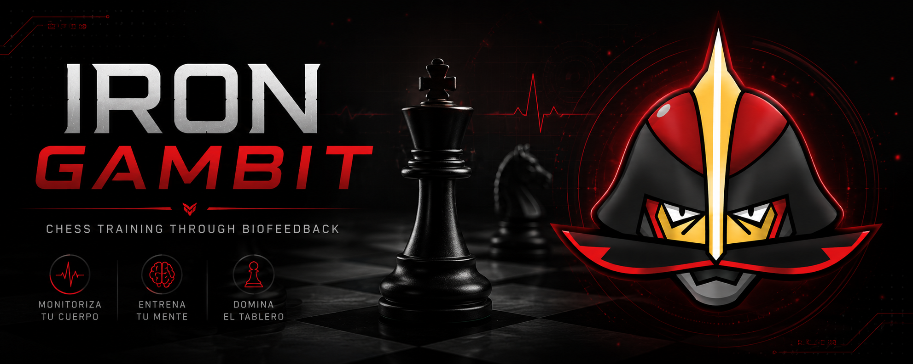

# Iron Gambit



**Iron Gambit** es una aplicación interactiva de ajedrez desarrollada como Trabajo de Fin de Grado (TFG) que integra tecnologías de biofeedback para adaptar dinámicamente las condiciones de la partida al estado fisiológico (estrés y relajación) del jugador humano.

La aplicación cuenta con una interfaz gráfica a medida construida sobre **Pygame**, que se conecta pasivamente a dispositivos de frecuencia cardíaca por Bluetooth Low Energy (BLE) y utiliza el motor de ajedrez **Stockfish** para el juego en solitario.

---

## Características Principales

### 1. Adaptación por Biofeedback (Frecuencia Cardíaca)

La aplicación monitoriza pasivamente las pulsaciones (BPM) del jugador en tiempo real (p. ej., desde relojes inteligentes **Polar** en modo "Compartir FC") y calcula una media móvil. De acuerdo a los umbrales configurados (Límite Inferior y Límite Superior):

- **Estado Relajado (FC <= Límite Inferior):** El jugador recibe una penalización de tiempo en su reloj (configurable en los ajustes, por defecto -10 segundos) por falta de activación.
- **Estado Estresado (FC >= Límite Superior):** Se activa un **"STOP por pulsaciones"** que bloquea temporalmente el tablero de juego y detiene los relojes para obligar al jugador a calmarse. Como compensación por el estrés, se le premia con tiempo extra (+10 segundos).

### 2. Analíticas Post-Partida y Exportación

Al finalizar la partida, se habilita una pantalla de análisis gráfico de la sesión:

- **Gráfica Premium de FC:** Visualización interactiva mediante un gráfico de líneas y sombreado de área que muestra la evolución de las pulsaciones (BPM) del jugador a lo largo de todo el encuentro.
- **Estadísticas en Tiempo Real:** Cálculo automático del ritmo cardíaco Mínimo, Máximo y Medio durante la partida.
- **Exportador a CSV:** Un botón de exportación que guarda un archivo estructurado con todos los datos cronometrados directamente en el **Escritorio de Windows** (`iron_gambit_frecuencia_cardiaca.csv`) con confirmación de guardado visual de 2 segundos.

### 3. Integración de Stockfish

- Integración nativa con **Stockfish AVX2** (motor de ajedrez líder de código abierto).
- **10 niveles de dificultad** ajustables desde el panel.
- Respuestas del motor humanizadas con retraso aleatorio configurable para emular el juego contra un rival real.

### 4. Personalización del Tablero

El menú de ajustes de personalización permite elegir entre 5 temas visuales inspirados en colores naturales y de marca:

- **Kingambit (Por defecto):** Estética oscura con detalles carmesí, gris acero y dorado metálico.
- **Verano:** Colores cálidos con casillas amarillas y naranja tostado.
- **Otoño:** Tonos otoñales con marrones tierra.
- **Invierno:** Colores fríos dominados por azul claro y glacial.
- **Primavera:** Tonos primaverales frescos basados en verde hoja y rosa pastel.

### 5. Historial y Repaso de Jugadas

- Registro de movimientos en la notación algebraica estándar (SAN).
- Posibilidad de **hacer clic sobre cualquier movimiento del historial** para retroceder en el tablero y repasar la posición en cualquier momento de la partida (incluso una vez finalizada).
- Para poder reanudar o seguir jugando, el tablero obliga a posicionarse en el último movimiento efectuado, garantizando la integridad de la partida.

---

## Atajos de Teclado y Controles

La interfaz de accesibilidad está optimizada con atajos rápidos de teclado organizados en la pantalla de ayuda en una cuadrícula compacta de dos columnas:

| Atajo | Acción |
| :---: | :--- |
| `N` | Nueva partida (abre el selector de bando: Blancas, Negras o Humano vs Humano) |
| `Z` / `Retroceso` | Deshacer el último movimiento completo (deshace la jugada humana y del motor) |
| `R` | Rotar/Voltear la perspectiva del tablero |
| `F11` | Alternar modo pantalla completa / ventana |
| `A` | Abrir la pestaña de **Ajustes** (Límites de FC, Tiempo de partida, Nivel del motor...) |
| `P` | Abrir la pestaña de **Personalización** (Elección de temas y colores de tablero) |
| `Esc` | Cerrar desplegables, salir del modo pantalla completa o confirmar la salida de la aplicación |

---

## Requisitos e Instalación

### Requisitos Previos

- **Python 3.10** o superior.
- Adaptador Bluetooth activo en el sistema para la conectividad BLE (requerido por `bleak`).

### Instalación

1. Clona el repositorio:

   ```bash
   git clone https://github.com/asimon02/TFG_Iron_Gambit.git
   cd TFG_Iron_Gambit
   ```

2. Instala las dependencias necesarias:

   ```bash
   pip install -r requirements.txt
   ```

3. Ejecuta la aplicación:

   ```bash
   python main.py
   ```

---

## Compilación a Ejecutable

El proyecto incluye un script automatizado `build.bat` para empaquetar el juego en un único archivo ejecutable (`.exe`) de Windows utilizando **PyInstaller**, empaquetando también el binario de Stockfish y los recursos gráficos.

Para generar el ejecutable, simplemente ejecuta desde la terminal de Windows:

```cmd
build.bat
```

El archivo resultante se creará en la raíz del proyecto como `Iron_Gambit.exe`.

---

## Tecnologías Utilizadas

- **Lenguaje:** Python.
- **Gráficos e Interfaz:** Pygame.
- **Conectividad BLE:** Bleak (Bluetooth Low Energy).
- **Lógica de Ajedrez:** Python-Chess.
- **Motor de Inteligencia Artificial:** Stockfish (motor UCI).
- **Procesamiento de Video (Intro Splash Screen):** OpenCV (cv2).
